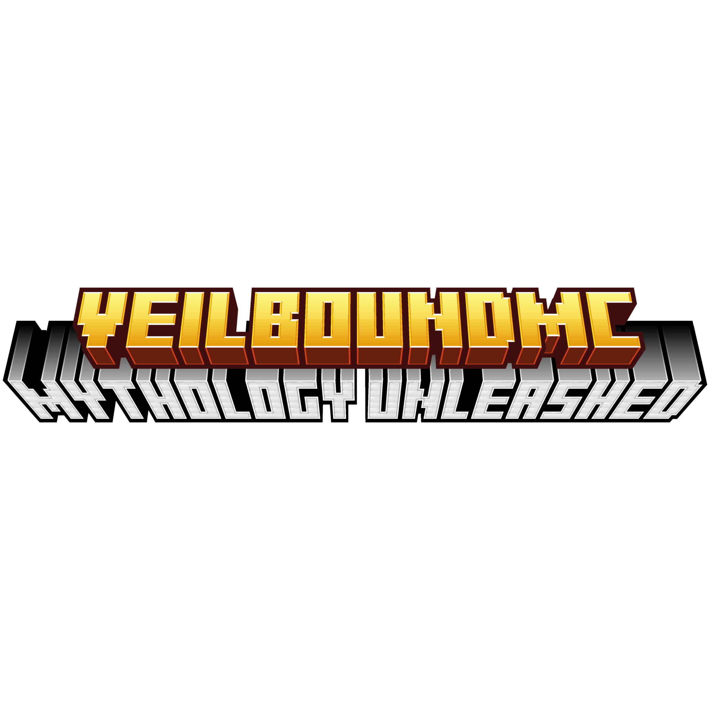

  

# 🌌 Veilbound
> *The myths were never just stories.*

---

## 📖 What is Veilbound?

**Veilbound** is a Minecraft mod that tears open the veil between the real world's ancient mythologies and your Minecraft world. Gods, monsters, cursed relics, and legendary weapons from cultures across history spill into your game — faithful to the myths that inspired them.

Every creature has lore. Every drop has purpose. Every weapon tells a story.

---

## ✨ What to Expect

- 👹 Mythical creatures with unique behaviors faithful to their original legends
- 💀 Drops and relics tied to each creature's myth
- ⚔️ Legendary weapons and gear crafted from mythical materials
- 📜 Deep lore rooted in real world mythology
- 🌍 Creatures, gods and stories from mythologies all across the world

---

## 🗺️ Mythologies

| Mythology | Status |
|---|---|
| 🇬🇷 Greek | 🔨 In Progress |
| 🇳🇴 Norse | 📋 Planned |
| 🇪🇬 Egyptian | 📋 Planned |
| 🇯🇵 Japanese | 📋 Planned |
| 🍀 Celtic | 📋 Planned |
| And many more... | 📋 Planned |

---

## 🔧 Installation

1. Download and install [Forge](https://files.minecraftforge.net/) or [Fabric](https://fabricmc.net/) for Minecraft 1.20+
2. Download the latest **Veilbound** release from the [Releases](../../releases) page
3. Drop the `.jar` file into your `mods` folder
4. Launch Minecraft and step through the veil 🌌

---

## 🤝 Contributing

Got a mythological creature, weapon or idea you'd love to see in Veilbound? Open an [Issue](../../issues) and share it! All mythologies and cultures are welcome.

---

## 📜 License

This project is licensed under the MIT License — see [LICENSE](LICENSE) for details.

---

  <i>"The veil is thin. Step through carefully."</i>
    
  ⭐ Star this repo if you're excited for Veilbound!

 
---

**NOT AN OFFICIAL MINECRAFT PRODUCT. NOT APPROVED BY OR ASSOCIATED WITH MOJANG OR MICROSOFT**

